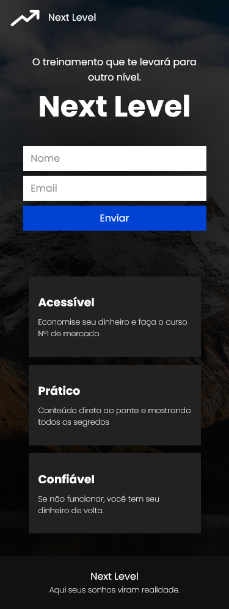

 

 
   
   

# Página de Captura

## Alô Marketeiros 😁
Esta é uma página de captura, que coleta emails (ou qualquer outro dado que você queira) e manda para uma conta no site <a href="https://mailchimp.com/">Mailchim</a>, onde você pode facilmente gerenciar as informações e exportar os contatos no formato de Excel (.xlsx) por exemplo.
___

## Dome
Acesse a <a href="https://gustavodias7.github.io/pagina-de-captura/">demonstração</a> do site.
___

## Status
Projeto não terminado. Ainda falta:
- Integração com o Mailchim.
___

## Meus Contatos
- <a href="https://www.linkedin.com/in/gustavo-dias-3100211b6/">Linkedin</a>
- <a href="https://www.instagram.com/eu.gustavodias/">Instagram</a>
___

## Créditos 
O layout foi fortemente inspirado em uma imagem do site <a href="https://www.mailerlite.com/features/landing-pages">mailerlite</a>.
